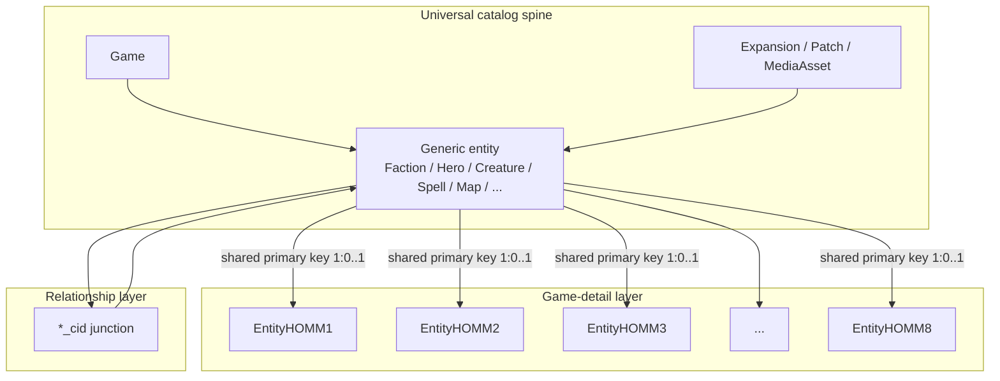
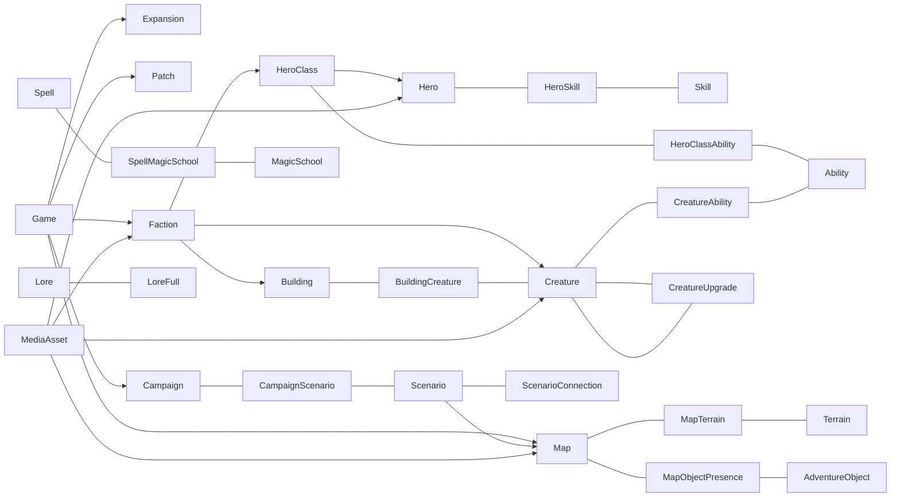
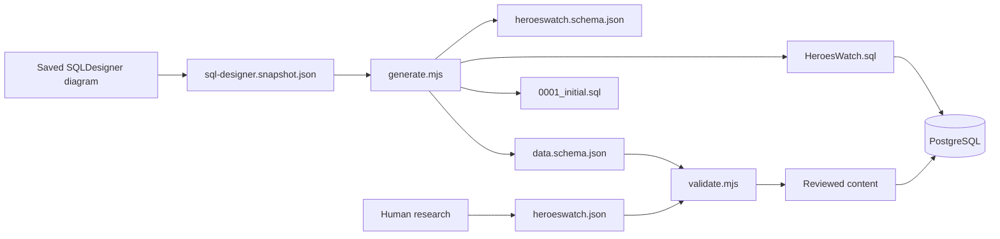

# HeroesWatch database architecture

## 1. System purpose

HeroesWatch is a cross-game reference platform for the Heroes of Might and
Magic series. Its database is an encyclopedia/catalog model: it describes
games, releases, factions, heroes, creatures, magic, towns, maps, campaigns,
media, and the relationships between them.

The database is designed to support:

- one website and API spanning every supported title;
- comparison of the same conceptual category between games;
- deep, title-specific mechanics without weakening the shared model;
- researched content with expansion, patch, source, and media provenance;
- incremental addition of later games without redesigning earlier games;
- safe PostgreSQL deployment and human data entry.

It is not a save-game database. Runtime player state—current armies, captured
towns, combat turns, inventories, multiplayer sessions, and map-instance
ownership—is outside this model.

## 2. Architectural shape

The model has three cooperating layers:

| Layer | Tables | Responsibility |
|---|---:|---|
| Universal catalog spine | 25 | Shared identity, naming, provenance, and cross-game concepts |
| Game-specific layer | 122 | 119 shared-PK details plus three independently identified title mechanics |
| Relationship/junction layer | 26 | Reusable many-to-many and graph relationships |



The universal spine answers “what is this thing?” The game-detail row answers
“how does this thing work in this title?” Junctions answer “how are these
things related?”

## 3. Universal catalog spine

The spine is the stable public vocabulary of the project. Generic rows own
identity and fields that have the same meaning across titles. A concept must
not be duplicated in a game table merely to make the diagram symmetrical.

### 3.1 Release and provenance

| Tables | Role |
|---|---|
| `Game` | Series title and top-level ownership boundary |
| `Expansion` | Expansions, editions, campaigns, and content packages |
| `Patch` | Version/platform-specific change provenance |
| `MediaAsset` | Images, audio, video, files, maps, and other reusable assets |
| `Resource`, `GameResource` | Shared resource identity plus per-game membership/presentation |

Most content catalogs are scoped by `Game_id`, use a stable `Code`, and may
point to the expansion or media asset that introduced or represents them.

### 3.2 World and faction domain

`Faction`, `Terrain`, `AdventureObject`, `TownScreen`, and `Map` describe the
strategic world. Factions link into heroes, classes, creatures, buildings,
spells, native terrain, and game-specific systems. Maps use junctions for
their terrain and object presence rather than embedding lists.

### 3.3 Hero and progression domain

`HeroClass`, `Hero`, `Skill`, and `Ability` separate four concepts:

- class/archetype;
- named hero identity;
- learnable progression category;
- discrete passive, active, racial, specialization, or creature mechanic.

All named heroes live in `Hero`. Campaign-only behavior is expressed through
detail fields and `CampaignHero`; a second hero catalog is not permitted.

### 3.4 Magic domain

`MagicSchool`, `Spell`, `Skill`, and `Ability` remain separate identities.
`SpellMagicSchool` models school membership. `FactionSpell` models faction
availability. Title-specific spell tiers, mastery, research, costs, runes,
warcries, or Astrology live in their game-detail tables.

Magic schools are first-class catalog rows; they are never hidden inside a
spell JSON document or treated only as a label.

### 3.5 Creature and town domain

`Creature`, `Ability`, `Building`, and `Resource` provide the common town and
army vocabulary. Reusable relations model:

- creature abilities and spells;
- creature upgrade edges;
- recruitment/resource costs;
- building requirements and upgrades;
- buildings that produce, recruit, or upgrade creatures;
- town-screen building placement.

Alternative or double-upgrade flags may live in a title's creature detail,
while the actual creature-to-creature relationship remains an FK-backed
upgrade edge where the shared graph requires it.

### 3.6 Artifact domain

`Artifact` owns item identity. `ArtifactComponent` expresses composite items,
and `ArtifactResourceCost` expresses costs. Game details store title-specific
slots, rarities, restrictions, upgrade behavior, and bounded set bonuses.

### 3.7 Narrative, map, lore, and media domain

`Campaign`, `Scenario`, and `Map` form distinct levels:

- campaign: a narrative collection;
- scenario: one mission/ruleset;
- map: the playable map asset and dimensions.

`CampaignScenario` orders scenarios. `ScenarioConnection` represents linear,
branching, optional, merge, and prerequisite paths. `CampaignHero` assigns
heroes and roles to campaigns.

`Lore` is the shared lore catalog. `LoreFull` connects lore to heroes,
campaign heroes, campaigns, scenarios, maps, and other subjects. Lore does
not need per-game duplicates because game scope and links already provide the
context.

`Soundtrack`, `Video`, and `Screenshot` describe published media and reference
`MediaAsset`. Town music is soundtrack data, not a separate town-music entity.

## 4. Game-detail architecture

A game-detail table is an optional one-to-one extension of a generic catalog
row. Its primary key is also an FK to the generic row:

```sql
"CreatureHOMM8"."Creature_id"
    PRIMARY KEY
    REFERENCES "Creature" ("Creature_id")
```

This is class-table inheritance expressed relationally.

Rules for game-detail tables:

1. The generic row is created first and owns identity, code, name, description,
   game, expansion, and general media.
2. A detail row exists only when the game has meaningful additional fields.
3. The detail row reuses the generic PK; it never allocates a second identity.
4. Shared mechanics stay in the spine or shared junctions.
5. Title-specific mechanics stay in that title's detail layer.
6. ID-only colored tables are omitted.
7. A new title extends downward through the existing category columns rather
   than creating a parallel isolated schema.

Not every category requires a detail table in every game. Missing detail means
the generic data is sufficient, not that the category is absent.

Unique title systems can have a dedicated in-band table when they possess real
identity or relationships. The current independently identified examples are
`FactionLaw`, `ArtifactSetHOMM5`, and `ArtifactSetBonusHOMM5`;
`AstrologyHOMM8` is instead a shared-PK game extension. Small variations
should normally become scalar fields on the nearest game-detail table rather
than new entities.

## 5. Relationship and graph architecture

The dark junction layer is shared infrastructure. It prevents each game band
from inventing its own copy of the same cardinality.

| Relationship family | Junctions |
|---|---|
| Magic | `SpellMagicSchool`, `FactionSpell`, `SpellResourceCostHOMM5` |
| Hero progression | `HeroSkill`, `HeroClassAbility`, `HeroClassPrimarySkillHOMM4` |
| Creatures | `CreatureAbility`, `CreatureUpgrade`, `CreatureSpell`, `CreatureResourceCost` |
| Buildings | `BuildingCreature`, `BuildingUpgrade`, `BuildingRequirement`, `BuildingResourceCost` |
| Artifacts/resources | `ArtifactComponent`, `ArtifactResourceCost`, `GameResource` |
| Campaign graph | `CampaignHero`, `CampaignScenario`, `ScenarioConnection` |
| Map graph | `MapTerrain`, `MapObjectPresence`, `TownScreenBuilding` |
| Lore graph | `LoreFull` |
| Title-specific cardinalities | `FactionNativeTerrainHOMM5`, `FactionMagicSchoolHOMM5` |

Each junction has a TEXT `*_cid` primary key. Junctions normally also have a
composite unique business key that prevents duplicate relationships.
`HeroClassAbility` is the current exception: it relies on
`HeroClassAbility_cid` until its prerequisite/choice fields have an approved
business-key definition.

All relationships shown in the design become real PostgreSQL foreign keys.
No application-only “soft FK” replaces a relationship that the database can
enforce.

## 6. Core domain graph



The graph is intentionally centered on reusable catalogs. Website queries can
start from a game, category, campaign, map, hero, or content item and traverse
the same enforced relationships.

## 7. Integrity model

The architecture deliberately distinguishes database-enforced integrity from
cross-row semantic integrity:

| Enforced by PostgreSQL | Enforced by validator/import/application |
|---|---|
| PK identity and uniqueness | A detail table's HOMM suffix matches its parent's `Game_id` |
| FK endpoint existence | Junction endpoints belong to the junction's game where required |
| Declared alternate unique keys | Expansion, patch, faction, map, and media references are game-consistent |
| Required versus nullable fields | Source-specific JSONB shape and content rules |
| ENUM membership | Release/preview status and research provenance policy |

Cross-game consistency is not a reason to duplicate identities. It is checked
at the data-ingestion boundary, while PostgreSQL remains responsible for
referential existence and key integrity.

## 8. PostgreSQL physical architecture

### 8.1 Deployment unit

The complete empty database is defined by
[`HeroesWatch.sql`](HeroesWatch.sql). Execute it once inside an empty
PostgreSQL database. It creates the `heroes_watch` schema, all tables, named
ENUM types, primary/unique/foreign-key constraints, and FK indexes. It inserts
no game data.

`HeroesWatch.backup` is the cross-platform PostgreSQL custom-format equivalent
for Restore tooling. It is schema-only and excludes owner and privilege data,
so the same structure can be restored on macOS, Windows, or Linux under a
different local database user.

`postgres/migrations/0001_initial.sql` is the immutable initial migration.
After a production database exists, structural changes must use new
forward-only migrations rather than rewriting `0001_initial.sql`.

### 8.2 Namespace and identifiers

- PostgreSQL schema: `heroes_watch`.
- PascalCase table names and established field spelling are preserved.
- Identifiers are quoted consistently because PostgreSQL otherwise folds them
  to lowercase.
- Independent BIGINT PKs use identity sequences.
- Shared-PK detail tables use the parent's BIGINT without a sequence.
- Junction `*_cid` keys remain TEXT.

### 8.3 Integrity and indexes

- Every table has a primary key.
- Alternate business keys become unique constraints.
- Every diagram edge becomes an FK.
- One-to-one targets are unique.
- FK checks are deferrable so a complete cyclic content graph can be inserted
  atomically without disabling integrity.
- Delete/update actions default to conservative `NO ACTION` because the design
  does not authorize cascading content deletion.
- Referencing FK columns receive indexes unless already covered by a PK or
  unique constraint.

### 8.4 Types

- SQLDesigner inline ENUMs become named PostgreSQL ENUM types.
- `BIGINT`, `INTEGER`, `SMALLINT`, `TEXT`, `BOOLEAN`, `DATE`, and `JSONB` map
  directly.
- JSONB remains for variable or source-native documents; entity identities,
  reusable values, and queryable relationships remain relational columns.

## 9. Schema and content lifecycle

Schema design and content entry are separate pipelines:



Structural source chain:

1. saved live diagram;
2. exact checked-in snapshot;
3. deterministic semantic JSON;
4. deterministic PostgreSQL DDL and migration.

Content source chain:

1. authoritative research;
2. cumulative human-readable JSON or direct reviewed GUI entry;
3. validation and review;
4. transactional insertion with all constraints enabled.

Generated files are never hand-edited. Content files never redefine schema.

## 10. Evolution rules

### Adding a game

1. Reuse every applicable generic catalog.
2. Add only detail fields that are genuinely different.
3. Reuse shared junctions for existing cardinalities.
4. Add a new junction only for a real relationship the graph cannot express.
5. Add a unique-mechanic table only when the mechanic has independent rows,
   identity, or relationships; otherwise add fields to the nearest detail.
6. Preserve shared hero, lore, resource, campaign, map, and media identities.

### Adding a category

A new generic category is justified only when it is reusable across games or
has independent identity and lifecycle. A title-specific variation alone does
not justify widening the universal spine.

### Versioning mechanics

Use `Expansion` for content ownership and `Patch` for version provenance.
Do not create historical-stat tables unless the product explicitly needs
queries across balance versions. Early Access or roadmap values must not be
presented as permanent released structure without version context.

## 11. Normalization policy

The relational target is second normal form for all ordinary tables, with the
explicit project exception for `*_cid` junction structures. Every ordinary
table has a single-column PK; composite alternate keys are audited for partial
dependencies. Bounded A/B or numbered scalar fields are a deliberate product
tradeoff and do not by themselves create partial-key dependencies.

The machine-readable audit is
[`schema/normal-form-report.json`](schema/normal-form-report.json). Detailed
normalization decisions belong there, not in the architectural overview.

## 12. Architectural invariants

These rules must remain true as the project grows:

- one generic identity per real content item;
- at most one shared-PK detail row per game/entity pair;
- no game-specific clone containing only an ID;
- no second hero or lore catalog;
- all real relationships enforced by FKs;
- generic junctions reused wherever cardinality permits;
- PostgreSQL and JSON artifacts generated from the same snapshot;
- schema migrations contain no game content;
- content entry does not disable constraints;
- live-diagram updates are incremental—never SQL Import replacement.

## 13. Non-goals

The current architecture does not attempt to model:

- player accounts, permissions, subscriptions, or website sessions;
- live matches, save games, combat actions, or turn history;
- mutable map-instance ownership and control zones;
- every historical balance value by patch;
- binary media storage inside PostgreSQL;
- speculative future mechanics without released evidence.

Those concerns may become separate application or service schemas later; they
should not be mixed into the catalog spine.
